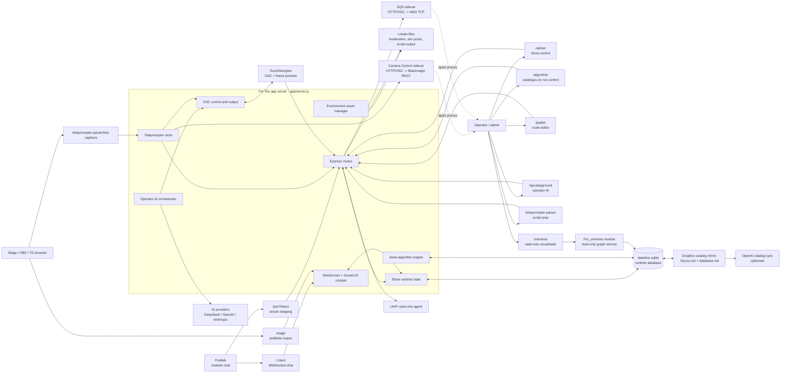
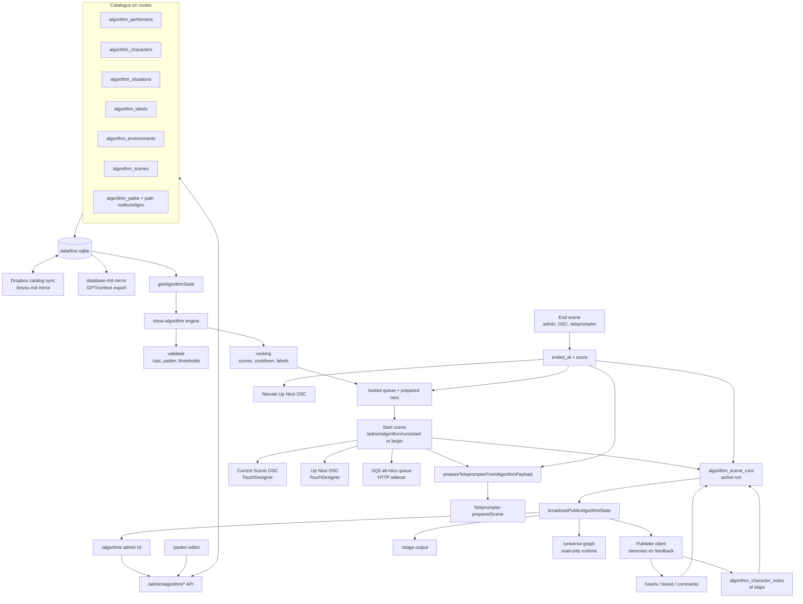
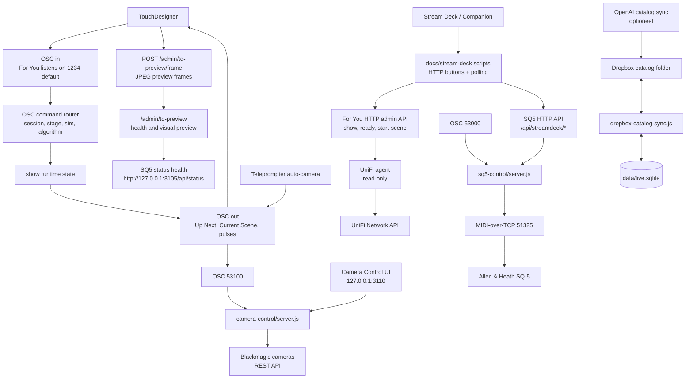
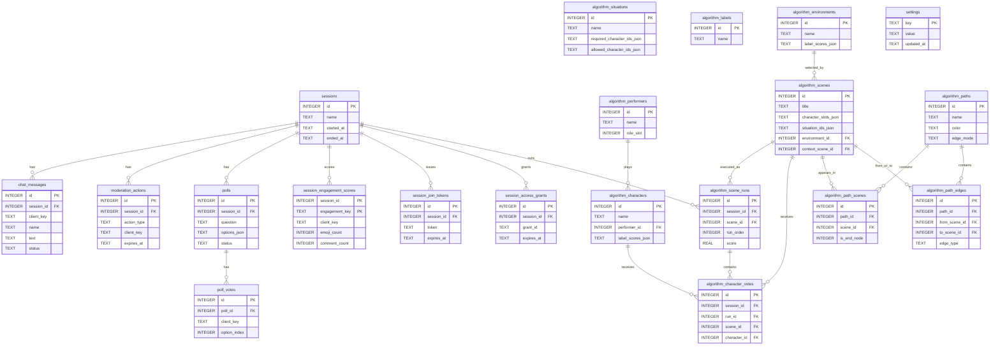

# For You Architectuur En Dataflow

Dit bestand is gegenereerd door `npm run docs:architecture`. Pas de bron-diagrammen aan in `docs/architecture/diagrams/` en draai daarna de generator opnieuw.

## Snel Lezen

- De app heeft een centrale Node/Express runtime in `app/server.js` met SQLite als canonieke runtime-database.
- Publiek gaat via QR/join naar de live chat; admin, stage, algoritme, paden, universe en teleprompter zijn aparte views op dezelfde runtime.
- `show-algorithm` bepaalt de volgorde/aanbeveling uit catalogusdata, paden en live feedback.
- TouchDesigner, SQ5, Camera Control, Stream Deck, UniFi, Dropbox en AI-providers hangen als integraties rondom de centrale app.
- For_universe is geen tweede runtime-database; het leest dezelfde `app/data/live.sqlite` read-only.

## Gegenereerde Kaarten

- [Routes](generated/routes.md): 170 route entries gevonden.
- [SQLite schema](generated/sqlite-schema.md): 30 tabellen gevonden.
- [Code dependencies](generated/code-deps.mmd): runtime `require(...)` relaties.

## 1. System Context

De hoofdkaart: wie praat met welke runtime, database en externe show-systemen.



## 2. Audience Session Flow

Van QR-token naar chat, moderatie, polls, engagement en algorithm metrics.

```mermaid
flowchart TD
  admin["Admin maakt sessie<br/>/admin/session/new-with-token"] --> session["sessions<br/>actieve show-sessie"]
  admin --> token["session_join_tokens<br/>QR token + expiry"]
  token --> qr["Stage QR output<br/>/stage/session-qr"]
  qr --> join["Publiek opent<br/>/join?token=..."]
  join --> grant["session_access_grants<br/>cookie voor huidige sessie"]
  grant --> client["Publieke client /"]

  client --> ws["WebSocket / Socket.IO compat"]
  ws --> register["register<br/>naam + clientTag"]
  ws --> message["message<br/>chat tekst"]
  ws --> reaction["reaction<br/>emoji / heart / bored"]

  message --> moderation["Moderatie<br/>bad-words, mute, block, rate-limit"]
  moderation --> chatMessages["chat_messages<br/>accepted / rejected"]
  reaction --> engagement["session_engagement_scores<br/>leaderboard en activiteit"]
  chatMessages --> adminState["/admin/state<br/>moderatie + live chat"]
  chatMessages --> stage["/stage<br/>chat overlay"]
  engagement --> stage

  admin --> pollStart["/admin/polls/start"]
  pollStart --> polls["polls"]
  client --> pollVote["poll_vote via WS"]
  pollVote --> pollVotes["poll_votes"]
  polls --> stage
  pollVotes --> stage

  chatMessages --> algorithmMetrics["Actieve scene metrics<br/>comment_count"]
  reaction --> algorithmMetrics
  algorithmMetrics --> run["algorithm_scene_runs<br/>heart, bored, comments, score"]
  run --> recommendation["Volgende aanbeveling<br/>show-algorithm"]

  session --> end["/admin/session/end"]
  end --> close["ended_at gezet<br/>clients moeten opnieuw joinen"]
```

## 3. Algorithm Scene Flow

Hoe catalogusdata scene-keuzes, runs, TouchDesigner, SQ5 en teleprompter voedt.



## 4. Teleprompter And Camera Flow

Hoe prepared scenes, ready/reveal, cueing, live captions en camera-pulsen lopen.

```mermaid
flowchart LR
  algorithm["Actieve / volgende scene<br/>algorithm payload"] --> prepare["prepareTeleprompterFromAlgorithmPayload"]
  adminParser["Teleprompter parser UI<br/>/teleprompter-parser"] --> parse["/admin/teleprompter-parser/parse"]
  adminParser --> ready["/admin/teleprompter-parser/ready"]
  adminParser --> reveal["/admin/teleprompter-parser/reveal"]

  prepare --> store["teleprompt-store<br/>current, cue, captionStyle, preparedScene"]
  parse --> store
  ready --> store
  reveal --> store

  store --> sse["/api/teleprompter-parser/events<br/>SSE"]
  store --> current["/api/teleprompter-parser/current"]
  sse --> stage["/teleprompter-parser/stage<br/>operator cue UI"]
  sse --> captions["/teleprompter-parser/live-captions<br/>stage captions"]
  current --> stage
  current --> captions

  stage --> cue["/api/teleprompter-parser/cue"]
  cue --> store
  cue --> autoCamera["Auto camera switch<br/>speaker slot mapping"]
  reveal --> autoCamera
  autoCamera --> tdCamera["TouchDesigner camera OSC pulse<br/>/osc/osc25..27"]
  autoCamera --> cameraSidecar["Camera Control sidecar<br/>optioneel via OSC/HTTP"]

  stage --> endCard["End-card advance"]
  captions --> endButton["End scene button"]
  endCard --> endScene["/api/teleprompter-parser/end-scene"]
  endButton --> endScene
  endScene --> showEnd["endActiveAlgorithmSceneRun"]
  showEnd --> prepare
  showEnd --> nextPulse["TouchDesigner next pulse"]

  style["Caption style API"] --> store
  store --> captionStyleFile["caption-style local file"]
```

## 5. Integration Sidecars

De losse show-processen rond de app: Stream Deck, TouchDesigner, SQ5, Camera Control, UniFi en Dropbox.



## 6. Database Model

Een vereenvoudigd ER-model van de belangrijkste runtime-tabellen.


